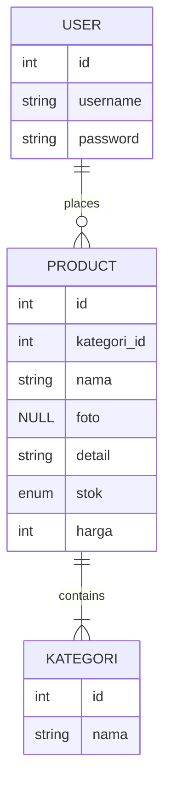
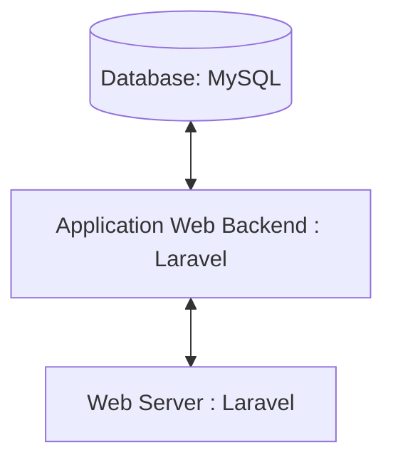

## 1.1 Latar Belakang

Aplikasi yang berbasis web mengenai pemasaran produk motor custom ini adalah motor yang digemari oleh beberapa anak muda baik itu laki-laki ataupun perempuan, bahkan kalangan orang tua pun menyukai motor jenis ini terutama bapak-bapak. pemasaran produk motor custom didasarkan pada pengakuan akan potensi pasar yang signifikan dalam industri motor custom. Dalam beberapa tahun terakhir, minat masyarakat terhadap motor custom telah berkembang pesat, menciptakan peluang bisnis yang menjanjikan. Konsumen yang ingin memiliki motor unik dan disesuaikan dengan preferensi pribadi mereka membutuhkan akses yang lebih mudah dan nyaman untuk menemukan dan membeli produk serta aksesori custom ini. Aplikasi yang akan dibuat ini adalah solusi ideal untuk menghadirkan pengalaman berbelanja yang lebih baik, memungkinkan perusahaan untuk menjangkau pasar yang lebih luas, dan meningkatkan keunggulan kompetitif dalam industri yang kompetitif. Selain itu, aplikasi ini dapat memberikan efisiensi dalam manajemen stok, pesanan, dan operasi penjualan, menghadirkan manfaat tambahan dalam menjalankan bisnis motor custom secara efisien.

## 1.2. Deksripsi Teknologi Informasi

Motor custom merupakan kendaraan roda dua yang dibangun dengan spesifikasi yang disesuaikan (customisasi). Biasanya dibangun dari satu basis motor tertentu, baik itu hanya diambil bagian rangka nya saja atau mesinnya. Website ini akan memberimu kesan yang baik dengan berbagai macam fitur yang disuguhkan untuk konsumen. CustomMotorbike menyediakan pengalaman belanja berbagai jenis motor yang nyaman, menarik, unik, dan tentunya berkualitas tinggi. Dengan menawarkan produk dengan kualitas yang tinggi, kekreatifan teknologi pun diuji guna meningkatkan pelayanan yang baik kepada konsumen, menciptakan berbagai macam fitur, mempermudah pemahaman konsumen terhadap apa yang di tawarkan, memberikan kenyamanan. Website ini akan terus berinovasi dalam pengembangan teknologi-teknologi yang semakin up to update.
## 1.3. Branding

Merk : CustomMotorbike

Tagline : "mari wujudkan desain motor sesukamu!"

Campaign : aplikasi ini akan membantu anda untuk mempermudah dalam mewujudkan desain motor sesuai dengan preferensi kamu sendiri lohh!

Target user :
- Usia 17+
- Seorang yang senang menuangkan keinginannya 
- Seorang yang senang mengeksplorasi berbagai jenis motor
- Seorang yang senang akan suasana baru 
- Seorang yang selalu ingin mengupdate sesuatu hal
- Seorang yang senang mengembangkan idenya
- Seorang yang senang mengembangkan hobby nya

User experience theme:
- klasik
- Sederhana
- Warna:
   - ala-ala monochrome /white
   - memberikan kesan kebersihan, ketenangan, kedamaian /grey
   - untuk memperindah agar warna terlihat lebih hidup /black
   - memberikan kesan tajam agar ballance dengan warna lainnya
- Inspirasi desain:

## 2. User Story

sebagai | saya ingin bisa | sehingga | prioritas
---|---|---|---
pengguna| melihat tampilan beranda | bisa melihat apa saja yang akan dibeli | ⭐⭐⭐⭐⭐
pengguna | melihat daftar produk | bisa memilih produk | ⭐⭐⭐⭐⭐
pengguna | melihat harga | bisa melihat harga sebelum checkout | ⭐⭐⭐⭐⭐
pengguna | mencari produk | bisa memudahkan dalam mencari sesuatu yang diinginkan | ⭐⭐⭐⭐⭐
pengguna | memiliki keranjang | bisa memasukkan produk ke dalam kerangjang dan memudahkan dalam menggabungkan/memilih kembali barang yang disukai | ⭐⭐⭐⭐⭐
pengguna | melihat keranjang | bisa melihat barang apa saja yang sudah masuk dalam keranjang | ⭐⭐⭐⭐⭐
pengguna | menghapus produk dari keranjang | produk tidak menumpuk | ⭐⭐⭐⭐
pengguna | melihat akun/profile | bisa mengupdate data | ⭐⭐⭐⭐⭐
pengguna | memiliki room chat | bisa memudahkan dalam komunikasi dengan produsen | ⭐⭐⭐⭐⭐
pengguna | membeli produk | bisa membawa pulang produk yang dipilih | ⭐⭐⭐⭐⭐
pengguna | mengedit produk yang sudah dipilih | keraguan yang tiba-tiba muncul dapat diubah | ⭐⭐⭐
pengguna | melihat diskon | bisa memilih diskon yang sesuai dengan produk | ⭐⭐⭐⭐
pengguna | memiliki voucher | bisa mendapatkan potongan harga | ⭐⭐⭐⭐
pengguna | memilih opsi pengiriman | bisa menentukan sesuai kebutuhan | ⭐⭐⭐⭐⭐
pengguna | memilih metode pembayaran | bisa memilih membayar menggunakan opsi yang diinginkan | ⭐⭐⭐
pengguna | melihat ringkasan pesanan | sebelum checkout produk bisa dilakukan pengecekan ulang | ⭐⭐⭐⭐⭐
pengguna | melihat fitur pesanan | bisa mengecek apakah pesanan sudah diproses/belum dan bisa melacak pesanan sudah berada dimana | ⭐⭐⭐⭐
pengguna | memiliki kolom penilaian | bisa menilai produk yang sudah dibeli | ⭐⭐⭐⭐
pengguna | menghubungi nomor produsen | bisa bertanya perihal produk secara lebih dalam | ⭐⭐⭐
admin | mengakses data user | bisa mengupdate/menghapus data user | ⭐⭐⭐⭐⭐
admin | mengakses pesanan masuk | bisa menerima/membatalkan pesanan | ⭐⭐⭐⭐⭐
admin | mengakses data transaksi | bisa memberikan tampilan selesai pembayaran/belum | ⭐⭐⭐⭐⭐
admin | edit produk | bisa mengganti harga/produk/menambahkan produk | ⭐⭐⭐⭐⭐
admin | upload produk | bisa menambahkan produk baru | ⭐⭐⭐⭐⭐
admin | memiliki bot chat | bisa mengirimkan pesan secara otomatis ketika pengguna chat untuk pertama kalinya | ⭐⭐⭐⭐
admin | memberikan diskon | bisa digunakan pengguna pada saat akan memilih barang yang sedang ada diskon| ⭐⭐⭐⭐
admin | memberikan voucher | bisa digunakan pengguna pada saat checkout produk pada ringkasan pesanan | ⭐⭐⭐⭐
admin | memberikan opsi metode pembayaran | bisa digunakan pengguna untuk memilih opsi pembayaran yang sesuai | ⭐⭐⭐

## 3. Struktur Data

Cara membuat aneka macam bentuk grafik menggunakan mermaid.js bisa lihat di [https://mermaid.js.org/syntax/entityRelationshipDiagram.html](https://mermaid.js.org/syntax/entityRelationshipDiagram.html) 

## 4. Arsitektur Sistem

Masih pake mermaid.js juga bisa lihat flowchart di [https://mermaid.js.org/syntax/flowchart.html](https://mermaid.js.org/syntax/flowchart.html)

## 5. Teknologi, Library, dan Framework

- Isi konten halaman web menggunakan HTML
- Styling halaman web menggunakan CSS
- Interaktivitas halaman web menggunakan JavaScript
- tekt editor menggunakan vscode

## 6. Desain User Experience dan User Interface

landing page 

## 7. Demonstrasi Video

## 8. Bagaimana mesin komputasi dan sistem operasi berperan dalam produk teknologi informasimu ?

1. **Mesin Komputasi:**
   - **Pemrosesan Data:** Mesin komputasi, seperti komputer atau perangkat seluler, berfungsi sebagai platform untuk pemrosesan data. Mereka dilengkapi dengan CPU (Central Processing Unit) yang bertanggung jawab untuk menjalankan instruksi-instruksi yang diberikan oleh perangkat lunak.
   - **Memori:** Mesin komputasi memiliki RAM (Random Access Memory) untuk menyimpan data yang sedang aktif dan dapat diakses secara cepat. Selain itu, mereka memiliki penyimpanan jangka panjang seperti hard drive atau SSD untuk menyimpan data secara permanen.
   - **Pengaturan Input/Output:** Mesin komputasi dapat menerima input dari pengguna melalui perangkat input seperti keyboard dan mouse, dan menghasilkan output melalui layar atau perangkat lainnya.

2. **Sistem Operasi:**
   - **Manajemen Sumber Daya:** Sistem operasi (OS) bertanggung jawab untuk mengelola sumber daya perangkat keras seperti CPU, memori, dan perangkat input/output. Ini memastikan bahwa aplikasi yang berjalan pada mesin komputasi dapat beroperasi secara efisien.
   - **Antarmuka Pengguna:** Sistem operasi menyediakan antarmuka pengguna yang memungkinkan pengguna berinteraksi dengan perangkat. Ini bisa berupa antarmuka grafis atau antarmuka baris perintah tergantung pada jenis sistem operasi.
   - **Manajemen File:** Sistem operasi juga bertanggung jawab untuk manajemen file, termasuk penyimpanan, penghapusan, dan organisasi file di dalam penyimpanan jangka panjang.
   - **Keamanan:** OS menyediakan fitur keamanan seperti kontrol akses, enkripsi data, dan perlindungan dari serangan malware untuk melindungi integritas dan kerahasiaan informasi.

3. **Interaksi Antar Mesin Komputasi dan Sistem Operasi:**
   - **Eksekusi Program:** Sistem operasi memungkinkan eksekusi program atau aplikasi pada mesin komputasi. OS bertanggung jawab untuk mengatur alokasi sumber daya dan menjalankan aplikasi sesuai dengan kebutuhan.
   - **Komunikasi Antar Aplikasi:** Dalam beberapa kasus, aplikasi perlu berkomunikasi satu sama lain. Sistem operasi menyediakan mekanisme untuk mendukung komunikasi ini, seperti penggunaan protokol komunikasi atau mekanisme pertukaran data.

Jadi, dalam produk teknologi informasi, mesin komputasi dan sistem operasi bekerja bersama-sama untuk menyediakan lingkungan di mana aplikasi dapat berjalan dan pengguna dapat berinteraksi dengan perangkat tersebut secara efisien. Keseluruhan, peran keduanya sangat penting untuk memastikan kinerja dan fungsionalitas yang baik dari produk tersebut.

## 9. Bagaimana algoritma, struktur data, dan bahasa pemrograman berperan dalam produk teknologi informasimu ?

Algoritma, struktur data, dan bahasa pemrograman memainkan peran krusial dalam pengembangan produk teknologi informasi.

1. **Algoritma:**
   - **Desain Logika Pemrosesan:** Algoritma adalah langkah-langkah logis yang diikuti untuk menyelesaikan suatu tugas atau masalah. Dalam pengembangan produk teknologi informasi, algoritma digunakan untuk merancang logika pemrosesan data, baik itu untuk menghitung, mengelola, atau mentransformasikan informasi.
   - **Efisiensi Kinerja:** Algoritma yang baik dapat meningkatkan efisiensi kinerja suatu aplikasi atau sistem. Desain algoritma yang efisien dapat mengoptimalkan penggunaan sumber daya, seperti waktu dan memori.

2. **Struktur Data:**
   - **Penyimpanan dan Pengorganisasian Data:** Struktur data menentukan cara data disimpan, diakses, dan diorganisasi. Pilihan struktur data yang tepat dapat mempengaruhi kinerja aplikasi dan efisiensi penyimpanan data.
   - **Manipulasi Data:** Struktur data menyediakan operasi dasar untuk manipulasi data, seperti pencarian, penyisipan, dan penghapusan. Contoh struktur data termasuk array, dll.

3. **Bahasa Pemrograman:**
   - **Implementasi Algoritma dan Struktur Data:** Bahasa pemrograman digunakan untuk mengimplementasikan algoritma dan struktur data. Pemilihan bahasa pemrograman dapat memengaruhi kinerja, keamanan, dan kemudahan pengembangan aplikasi.
   - **Abstraksi dan Produktivitas:** Bahasa pemrograman menyediakan tingkat abstraksi yang berbeda. Pemrogram dapat memilih bahasa yang sesuai dengan tingkat abstraksi yang diperlukan untuk kebutuhan pengembangan mereka. Beberapa bahasa pemrograman, seperti Python, menawarkan produktivitas tinggi dengan sintaksis yang mudah dipahami, sementara bahasa seperti C atau C++ menawarkan kendali tingkat rendah untuk optimisasi kinerja.

Dalam konteks produk teknologi informasi, integrasi yang baik antara algoritma, struktur data, dan bahasa pemrograman sangat penting untuk mencapai tujuan yang diinginkan. Misalnya, dalam pengembangan aplikasi web, pemilihan algoritma pencarian atau penyortiran, struktur data untuk menyimpan dan mengelola informasi, dan bahasa pemrograman untuk mengimplementasikannya dapat mempengaruhi kecepatan akses data dan responsivitas aplikasi.

Secara keseluruhan, kombinasi yang bijak antara algoritma yang efisien, struktur data yang tepat, dan bahasa pemrograman yang cocok dapat membantu menciptakan produk teknologi informasi yang unggul dalam kinerja, keamanan, dan kehandalan.

## 10. Bagaimana metode pengembangan perangkat lunak / Software Development Life Cycle berperan dalam produk teknologi informasimu ?

Metode Pengembangan Perangkat Lunak, atau yang dikenal sebagai Software Development Life Cycle (SDLC), adalah pendekatan sistematis untuk merancang, mengembangkan, dan memelihara perangkat lunak. SDLC berperan penting dalam pengembangan produk teknologi informasi. Di bawah ini ada  beberapa tahapan dalam SDLC dan peran masing-masing:

1. **Perencanaan (Planning):**
   - **Perencanaan Proyek:** Tahap ini melibatkan identifikasi tujuan proyek, menentukan ruang lingkup, alokasi sumber daya, dan membuat rencana proyek. Perencanaan yang baik membantu dalam menetapkan ekspektasi dan memastikan sumber daya yang memadai.

2. **Analisis (Analysis):**
   - **Pemahaman Kebutuhan:** Analisis kebutuhan pelanggan dan pengguna adalah fokus utama dalam tahap ini. Dokumen kebutuhan dibuat untuk memahami apa yang diinginkan oleh pengguna akhir.

3. **Desain (Design):**
   - **Desain Sistem dan Arsitektur:** Desain melibatkan perancangan sistem dan arsitektur perangkat lunak. Pada tahap ini, keputusan tentang infrastruktur, database, dan komponen perangkat lunak diambil.

4. **Implementasi (Implementation):**
   - **Pengkodean:** Tahap implementasi melibatkan pengkodean perangkat lunak berdasarkan desain yang telah dibuat sebelumnya. Pemrograman dilakukan sesuai dengan standar dan praktik terbaik.

5. **Pengujian (Testing):**
   - **Verifikasi dan Validasi:** Pengujian dilakukan untuk memverifikasi dan memvalidasi bahwa perangkat lunak berfungsi sesuai dengan spesifikasinya. Ini mencakup pengujian fungsional, pengujian kinerja, dan pengujian keamanan.

6. **Pengiriman (Deployment):**
   - **Implementasi di Lingkungan Produksi:** Setelah berhasil melewati tahap pengujian, perangkat lunak diterapkan di lingkungan produksi. Ini melibatkan instalasi perangkat lunak dan konfigurasi yang diperlukan.

7. **Pemeliharaan (Maintenance):**
   - **Perbaikan dan Pembaruan:** Setelah implementasi, perangkat lunak memasuki tahap pemeliharaan di mana pembaruan, perbaikan bug, dan perubahan lainnya dilakukan untuk memastikan ketersediaan dan keandalan jangka panjang.

**Peran SDLC dalam Produk Teknologi Informasi:**
- **Kualitas Produk:** SDLC membantu dalam pengembangan produk dengan kualitas tinggi dengan memastikan setiap tahap melibatkan pengujian yang menyeluruh dan validasi.
  
- **Manajemen Risiko:** SDLC membantu dalam mengidentifikasi dan mengelola risiko dengan baik melalui tahapan perencanaan dan analisis.

- **Manajemen Proyek:** Tahapan perencanaan dan pemantauan dalam SDLC membantu dalam manajemen proyek secara efektif, termasuk pengelolaan sumber daya dan waktu.

- **Komunikasi yang Efektif:** SDLC membantu dalam menjaga komunikasi yang efektif antara tim pengembangan, pemangku kepentingan, dan pengguna akhir.

- **Dokumentasi:** Setiap tahap dalam SDLC menciptakan dokumentasi yang berharga, termasuk spesifikasi kebutuhan, desain sistem, dan dokumentasi pengujian. Dokumentasi ini sangat penting untuk pemahaman yang jelas tentang produk.

Dengan mengikuti SDLC, pengembang dapat memastikan bahwa produk teknologi informasi yang dihasilkan mencapai standar kualitas, memenuhi kebutuhan pengguna, dan dapat dielola secara efisien selama siklus hidupnya.

## 11. Bagaimana database / sistem basis data berperan dalam produk teknologi informasimu ?

Basis data atau sistem basis data (Database Management System - DBMS) memainkan peran kunci dalam produk teknologi informasi.

1. **Penyimpanan Data:**
   - Basis data berfungsi sebagai tempat penyimpanan yang terstruktur untuk data. Ini termasuk informasi pengguna, konfigurasi sistem, dan data lainnya yang diperlukan untuk operasi produk teknologi informasi.

2. **Akses dan Pencarian Data:**
   - DBMS memungkinkan pengguna untuk mengakses dan mencari data dengan cepat. Melalui bahasa kueri, pengembang atau pengguna dapat mengekstrak informasi yang dibutuhkan tanpa harus melalui seluruh set data.

3. **Integritas Data:**
   - Sistem basis data memastikan integritas data dengan menerapkan aturan dan batasan pada data. Ini termasuk kunci unik, kunci asing, dan aturan integritas referensial untuk memastikan konsistensi data.

4. **Keamanan Data:**
   - DBMS menyediakan lapisan keamanan untuk melindungi data dari akses yang tidak sah. Ini mencakup pengaturan hak akses pengguna, enkripsi data, dan pelacakan aktivitas pengguna.

5. **Manajemen Transaksi:**
   - Basis data mendukung manajemen transaksi untuk memastikan konsistensi data. Transaksi dapat digunakan untuk mengelola serangkaian operasi yang harus dieksekusi secara bersamaan atau tidak sama sekali.

6. **Kemudahan Pemeliharaan:**
   - DBMS menyederhanakan pemeliharaan data dengan menyediakan alat untuk membuat cadangan data, memulihkan data, dan melakukan tugas pemeliharaan lainnya. Ini membantu menjaga ketersediaan dan keandalan sistem.

7. **Skalabilitas:**
   - Sistem basis data memungkinkan skalabilitas, artinya mereka dapat menangani peningkatan jumlah data tanpa menurunkan kinerja. Ini penting ketika produk teknologi informasi mengalami pertumbuhan.

8. **Pengelolaan Versi dan Riwayat Data:**
   - Beberapa sistem basis data mendukung manajemen versi dan riwayat data, memungkinkan pengguna untuk melacak perubahan data dari waktu ke waktu. Ini dapat membantu dalam analisis dan audit.

9. **Pemrosesan Transaksi dan Analisis:**
   - DBMS dapat mendukung baik pemrosesan transaksi operasional maupun analisis data. Ini memungkinkan produk teknologi informasi untuk menyediakan layanan operasional sehari-hari sambil menghasilkan wawasan dari data yang disimpan.

10. **Integrasi dengan Aplikasi:**
    - Sistem basis data dapat diintegrasikan dengan aplikasi lain, memungkinkan pertukaran data antara berbagai komponen sistem. Ini memfasilitasi kolaborasi dan integrasi produk.

Pentingnya sistem basis data dalam produk teknologi informasi tidak dapat diabaikan. Dengan menyediakan tempat penyimpanan yang terstruktur, memastikan akses yang cepat, dan menangani aspek keamanan dan integritas data, sistem basis data menjadi landasan yang kuat untuk aplikasi dan sistem informasi modern.
