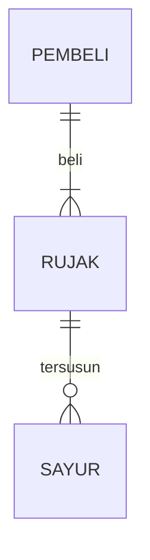

## 1.1 Latar Belakang

Aplikasi yang berbasis web mengenai pemasaran produk motor custom ini adalah motor yang digemari oleh beberapa anak muda baik itu laki-laki ataupun perempuan, bahkan kalangan orang tua pun menyukai motor jenis ini terutama bapak-bapak. pemasaran produk motor custom didasarkan pada pengakuan akan potensi pasar yang signifikan dalam industri motor custom. Dalam beberapa tahun terakhir, minat masyarakat terhadap motor custom telah berkembang pesat, menciptakan peluang bisnis yang menjanjikan. Konsumen yang ingin memiliki motor unik dan disesuaikan dengan preferensi pribadi mereka membutuhkan akses yang lebih mudah dan nyaman untuk menemukan dan membeli produk serta aksesori custom ini. Aplikasi yang akan dibuat ini adalah solusi ideal untuk menghadirkan pengalaman berbelanja yang lebih baik, memungkinkan perusahaan untuk menjangkau pasar yang lebih luas, dan meningkatkan keunggulan kompetitif dalam industri yang kompetitif. Selain itu, aplikasi ini dapat memberikan efisiensi dalam manajemen stok, pesanan, dan operasi penjualan, menghadirkan manfaat tambahan dalam menjalankan bisnis motor custom secara efisien.

## 1.2. Deksripsi Teknologi Informasi

Motor custom merupakan kendaraan roda dua yang dibangun dengan spesifikasi yang disesuaikan (customisasi). Biasanya dibangun dari satu basis motor tertentu, baik itu hanya diambil bagian rangka nya saja atau mesinnya. Website ini akan memberimu kesan yang baik dengan berbagai macam fitur yang disuguhkan untuk konsumen. CustomMotorbike menyediakan pengalaman belanja berbagai jenis motor yang nyaman, menarik, unik, dan tentunya berkualitas tinggi. Dengan menawarkan produk dengan kualitas yang tinggi, kekreatifan teknologi pun diuji guna meningkatkan pelayanan yang baik kepada konsumen, menciptakan berbagai macam fitur, mempermudah pemahaman konsumen terhadap apa yang di tawarkan, memberikan kenyamanan. Website ini akan terus berinovasi dalam pengembangan teknologi-teknologi yang semakin up to update.
## 1.3. Branding

Merk : CustomMotorbike

Tagline : "mari wujudkan desain motor sesukamu!"

Campaign : aplikasi ini akan membantu anda untuk mempermudah dalam mewujudkan desain motor sesuai dengan preferensi kamu sendiri lohh!

Target user :
- Usia 17+
- Seorang yang senang menuangkan keinginannya 
- Seorang yang senang mengeksplorasi berbagai jenis motor
- Seorang yang senang akan suasana baru 
- Seorang yang selalu ingin mengupdate sesuatu hal
- Seorang yang senang mengembangkan idenya
- Seorang yang senang mengembangkan hobby nya

User experience theme:
- klasik
- Sederhana
- Warna: ala-ala monochrome /white -> memberikan kesan kebersihan, ketenangan, kedamaian /grey  -> untuk memperindah agar warna terlihat lebih hidup /black -> memberikan kesan tajam agar ballance dengan warna lainnya
- Inspirasi desain:

## 2. User Story

sebagai | saya ingin bisa | sehingga | prioritas
---|---|---|---
pengguna| melihat tampilan beranda | bisa melihat apa saja yang akan dibeli | ⭐⭐⭐⭐⭐
pengguna | melihat daftar produk | bisa memilih produk | ⭐⭐⭐⭐⭐
pengguna | mencari produk | bisa memudahkan dalam mencari sesuatu yang diinginkan | ⭐⭐⭐⭐⭐
pengguna | memiliki keranjang | bisa memasukkan produk ke dalam kerangjang dan memudahkan dalam menggabungkan/memilih kembali barang yang disukai | ⭐⭐⭐⭐⭐
pengguna | melihat keranjang | bisa melihat barang apa saja yang sudah masuk dalam keranjang | ⭐⭐⭐⭐⭐
pengguna | menghapus produk dari keranjang | produk tidak menumpuk | ⭐⭐⭐⭐
pengguna | melihat akun/profile | bisa mengupdate data | ⭐⭐⭐⭐⭐
pengguna | memiliki room chat | bisa memudahkan dalam komunikasi dengan produsen | ⭐⭐⭐⭐⭐
pengguna | membeli produk | bisa membawa pulang produk yang dipilih | ⭐⭐⭐⭐⭐
pengguna | mengedit produk yang sudah dipilih | keraguan yang tiba-tiba muncul dapat diubah | ⭐⭐⭐
pengguna | melihat diskon | bisa memilih diskon yang sesuai dengan produk | ⭐⭐⭐⭐
pengguna | memiliki voucher | bisa mendapatkan potongan harga | ⭐⭐⭐⭐
pengguna | memilih opsi pengiriman | bisa menentukan sesuai kebutuhan | ⭐⭐⭐⭐⭐
pengguna | memilih metode pembayaran | bisa memilih membayar menggunakan opsi yang diinginkan | ⭐⭐⭐
pengguna | melihat ringkasan pesanan | sebelum checkout produk bisa dilakukan pengecekan ulang | ⭐⭐⭐⭐⭐
pengguna | melihat fitur pesanan | bisa mengecek apakah pesanan sudah diproses/belum dan bisa melacak pesanan sudah berada dimana | ⭐⭐⭐⭐
pengguna | memiliki kolom penilaian | bisa menilai produk yang sudah dibeli | ⭐⭐⭐⭐
admin | mengakses data user | bisa mengupdate/menghapus data user | ⭐⭐⭐⭐⭐
admin | mengakses pesanan masuk | bisa menerima/membatalkan pesanan | ⭐⭐⭐⭐⭐
admin | mengakses data transaksi | bisa memberikan tampilan selesai pembayaran/belum | ⭐⭐⭐⭐⭐
admin | edit produk | bisa mengganti harga/produk/menambahkan produk | ⭐⭐⭐⭐⭐
admin | upload produk | bisa menambahkan produk baru | ⭐⭐⭐⭐⭐
admin | memiliki bot chat | bisa mengirimkan pesan secara otomatis ketika pengguna chat untuk pertama kalinya | ⭐⭐⭐⭐
admin | memberikan diskon | bisa digunakan pengguna pada saat akan memilih barang yang sedang ada diskon| ⭐⭐⭐⭐
admin | memberikan voucher | bisa digunakan pengguna pada saat checkout produk pada ringkasan pesanan | ⭐⭐⭐⭐
admin | memberikan opsi metode pembayaran | bisa digunakan pengguna untuk memilih opsi pembayaran yang sesuai | ⭐⭐⭐

## 3. Struktur Data

Cara membuat aneka macam bentuk grafik menggunakan mermaid.js bisa lihat di [https://mermaid.js.org/syntax/entityRelationshipDiagram.html](https://mermaid.js.org/syntax/entityRelationshipDiagram.html) 

## 4. Arsitektur Sistem

Masih pake mermaid.js juga bisa lihat flowchart di [https://mermaid.js.org/syntax/flowchart.html](https://mermaid.js.org/syntax/flowchart.html)

## 5. Teknologi, Library, dan Framework

bla bla bla

## 6. Desain User Experience dan User Interface

Bisa load image 

## 7. Demonstrasi Video

Link youtube nya

## 8. Bagaimana mesin komputasi dan sistem operasi berperan dalam produk teknologi informasimu ?

Link youtube nya di detik jawaban ini

## 9. Bagaimana algoritma, struktur data, dan bahasa pemrograman berperan dalam produk teknologi informasimu ?

Link youtube nya di detik jawaban ini

## 10. Bagaimana metode pengembangan perangkat lunak / Software Development Life Cycle berperan dalam produk teknologi informasimu ?

Link youtube nya di detik jawaban ini

## 11. Bagaimana database / sistem basis data berperan dalam produk teknologi informasimu ?

Link youtube nya di detik jawaban ini
